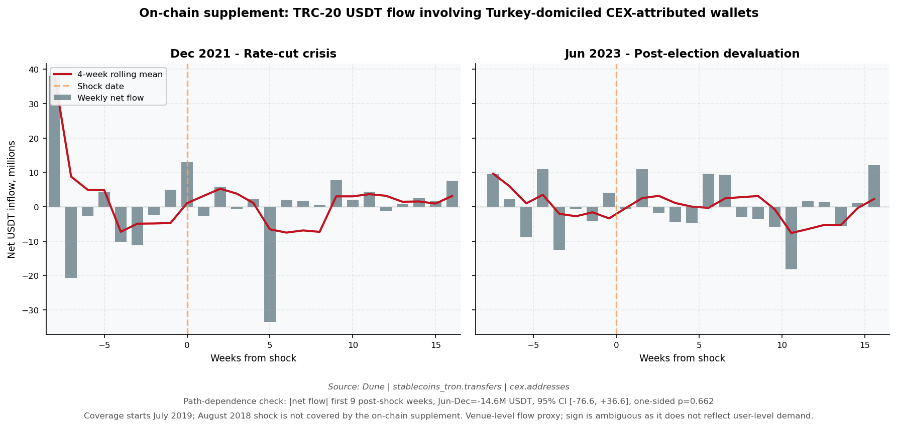

# Public Proxies for USDT Demand Pressure in Turkey: A Path-Dependence Test

*Anne-Lise Saive (April 2026)*

## Overview

This is a self-initiated empirical project testing whether USDT demand pressure in Turkey responds to monetary shocks in a path-dependent way, where earlier high-salience shocks amplify the response to later ones.

The short answer is that, with public data, there is no robust evidence for this. The premium series appears to be dominated by short-horizon market dynamics rather than slower behavioral accumulation. A weaker signal shows up in first differences on one event window, but it does not hold as a general result. The null is the most reliable conclusion.

## Scope


Turkey was chosen as a strong first candidate because it combines large local stablecoin activity, a liquid USDT/TRY market, and several well-separated monetary shock episodes.

The main off-chain analysis covers three shock windows:

- **August 2018** tariff shock and rapid currency collapse
- **December 2021** rate-cut driven crisis
- **June 2023** post-election devaluation

The on-chain supplement is narrower. It uses TRC-20 USDT flows involving Turkey-domiciled CEX-attributed wallets from July 2019 onward. This means the on-chain supplement covers the 2021 and 2023 evaluation windows, but **not** the August 2018 tuning shock. The 2018 episode is therefore part of the off-chain premium model only.

A full test of the hypothesis would extend to a cross-country panel
(e.g. ARS, NGN, VES, RUB), use mechanical event detection rather than a
curated catalogue, and triangulate across multiple demand proxies including
on-chain net flows, P2P offer prices, and exchange-specific premiums to
isolate behavioral demand from microstructure noise. The on-chain supplement
included here (see `onchain_supplement.py`) is a first step in that direction.


## Motivation

The hypothesis comes from computational models of carrying salience effects. The idea is that salient past events are strongly remembered and reduce the threshold for reacting to future cues. Formally, behavior depends not only on current input $x_t$, but on an accumulated memory term:

$$
\text{response}_t = f(x_t, M(t))
$$

where $M(t)$ summarizes prior exposure.

Transposed to this setting, a severe currency shock could leave a trace that makes later shocks trigger stronger demand for stablecoin protection, even if they are smaller.

Turkey provides a clean empirical setting, with three distinct and well-separated episodes:
- **August 2018**  tariff shock and rapid currency collapse
- **December 2021**  rate-cut driven crisis
- **June 2023**  post-election devaluation
These allow a simple tuning, evaluation, and robustness sequence without overlap.

## What is observed

The dependent variable is the USDT/TRY premium:

$$
p_t = \log\left(\frac{\text{USDT/TRY}_{\text{Binance}}}{\text{USD/TRY}_{\text{official}}}\right)
$$

This premium reflects how much local buyers are willing to pay above FX parity to access stablecoins quickly. It captures demand pressure and urgency. It is influenced by adoption, but also by liquidity conditions, arbitrage frictions, and constraints on capital movement. It should therefore be treated as a noisy proxy rather than a direct measure of user-level adoption.

### What the premium does and does not capture

The premium $p_t$ is a useful but imperfect proxy. It conflates at least three
components:

1. **Genuine demand pressure** for stablecoin protection, the variable of
   interest.
2. **Binance lira-rails friction** banking access, deposit/withdrawal limits,
   KYC frictions, all of which varied substantially over 2018–2024.
3. **The parallel-USD premium** accessible only via informal channels, which
   during severe lira stress can exceed 2–6% even for cash USD.

directly to (1), at the cost of capturing a different slice of the same
These cannot be cleanly separated using off-chain price data alone.

<<<<<<< Updated upstream
The on-chain supplement (`onchain_supplement.py`) provides a complementary proxy: TRC-20 USDT gross and net flows involving Paribu- and BtcTurk-attributed wallets. This is closer to exchange-level stablecoin activity, but it still does **not** identify Turkish end-users and does not separate customer behavior from exchange treasury operations, wallet rebalancing, OTC flows, or operational hot-wallet management.

=======
The on-chain supplement (`onchain_supplement.py`) provides a complementary
venue-level proxy: TRC-20 USDT gross and net flows involving Paribu- and
BtcTurk-attributed wallets. It is useful as corroborating exchange-level
evidence, but it is not a direct wallet-cohort test of the behavioral
hypothesis. A single attributed hot wallet can aggregate activity from one
large account or many users, and the data do not separate customer behavior
from exchange treasury operations, wallet rebalancing, OTC flows, or
operational hot-wallet management.
>>>>>>> Stashed changes
# On-chain supplement

The on-chain supplement uses a Dune query to aggregate weekly TRC-20 USDT flows involving Paribu- and BtcTurk-attributed wallets. It computes:

- inflow USDT into the matched CEX wallet set
- outflow USDT from the matched CEX wallet set
- gross flow, defined as inflow plus outflow
- net flow, defined as inflow minus outflow
- absolute net share, defined as `abs(net_flow) / gross_flow`

The sign of CEX net flow is ambiguous. A positive inflow can reflect users
sending USDT to the exchange to sell for TRY, or exchange-side wallet
management to support TRY-to-USDT demand. Without a stablecoin/TRY pair-volume
cross-check, the supplement should be read as flow amplitude at the venue
level, not as directional adoption pressure.

The supplement also runs a path-dependence check on the two covered event
windows. It compares the absolute net-flow integral over the first nine
post-shock weekly buckets for December 2021 and June 2023, then reports a
bootstrap confidence interval and a paired sign-flip permutation p-value for
the Jun-minus-Dec difference.

The supplement does not identify individual Turkish users, self-custody
behavior, P2P activity, or causal demand. It is corroborating evidence at the
venue level, not a direct test of the user-level path-dependence mechanism.

Because the on-chain data start in July 2019, the supplement covers December 2021 and June 2023 only. It does not cover August 2018.



## Data

All inputs are public and reproducible:

- Binance weekly USDT/TRY data
- yfinance USD/TRY exchange rate
- World Bank CPI (used only for validation)
- Google Trends search interest in Turkey
- Dune TRC-20 USDT transfer data for the on-chain supplement

Inflation is proxied using a rolling FX-based measure to match the weekly frequency of the data.

## Methodology

### Memory representation

Past shocks are summarized through a salience-weighted memory kernel:

$$
M(t) = \sum_{i} \text{ESS}_i \cdot e^{-\lambda(t - t_i)}
$$

Each event $i$ is assigned an Emotional Salience Score:

$$
\text{ESS}_i = w_{\text{mag}} \cdot \text{Magnitude}_i + w_{\text{abr}} \cdot \text{Abruptness}_i + w_{\text{rel}} \cdot \text{Relevance}_i
$$

The decay parameter $\lambda$ and weights $w$ are estimated on the August 2018 event and then kept unchanged.

### Model structure

Three nested models are compared.

**Model A  memoryless baseline**

$$
p_t = \alpha + \phi p_{t-1} + \beta X_t + \epsilon_t
$$

where $X_t$ includes FX shocks, volatility, inflation proxy, and search trends.

**Model B  path-dependence**

$$
p_t = \alpha + \phi p_{t-1} + \beta X_t + \gamma M(t) + \delta (X_t \cdot M(t)) + \epsilon_t
$$

This tests whether accumulated prior exposure modifies current responses.

**Model C  exploratory asymmetries**

Extensions of Model B introducing interactions such as:

$$
\text{Trends}_t \cdot M(t), \quad \text{Abruptness}_t \cdot M(t), \quad \text{Similarity}_t \cdot M(t)
$$

These test whether reactivation depends on attention, thresholds, or similarity to past events.

### Validation design

The design enforces strict separation:

- Parameters tuned on August 2018
- Evaluated out-of-sample on December 2021
- Tested again on June 2023 without refitting

Additional safeguards include event-centered windows, AR(1) structure to avoid leakage, a trend-null comparator, placebo tests on random dates, and bootstrap resampling.

## Results

### Levels: a clear null result

Out-of-sample performance in levels is strongly negative across all models in both evaluation windows. Model B does not outperform the baseline, and gains are indistinguishable from placebo variation.

This indicates that $R^2_{\text{OOS}} \ll 0$ for all specifications. The premium series is not predictable at this resolution using these inputs. This reflects the volatility and instability of the target, rather than a failure of a specific model.

### First differences: limited signal

Modeling changes in the premium $\Delta p_t = p_t - p_{t-1}$ produces a small positive out-of-sample $R^2$ in one robustness window. An interaction between search trends and accumulated exposure appears in that specification. However, it does not appear consistently across events, it is not present in the primary specification, and it does not survive as a general result. This is best interpreted as a tentative indication, not evidence.

### Memory timescale

The selected decay parameter implies a very short fitted response timescale. With $\lambda \approx 0.68$ on weekly data, the half-life is:

$$
t_{1/2} = \frac{\ln(2)}{\lambda} \approx 1 \text{ week}
$$

This is consistent with short-horizon market dynamics rather than slow behavioral accumulation. In practice, the memory kernel is best interpreted as an event-window response term rather than direct evidence of long-lived behavioral memory.

This sharpens the main conclusion. A behavioral path-dependence mechanism would predict longer persistence. What is observed instead is rapid decay, no out-of-sample gain over the memoryless baseline, and a placebo distribution indistinguishable from the real result.

## Interpretation

The absence of a robust signal does not imply that path-dependence does not exist. The hypothesis is about how individual behavior shifts over time, which is not observable using an aggregated price index that flattens everyone into one number. 
To test this hypothesis, this would need wallet-level data, user cohorts, and geographic resolution across multiple countries and events. This would allow testing whether prior exposure changes adoption thresholds, timing, and persistence at the user level.

## Reproducing

```bash
git clone https://github.com/annelisesaive/usdt-demand-pressure-turkey
cd usdt-demand-pressure-turkey

python -m venv venv
source venv/bin/activate
pip install -r requirements.txt

python analysis.py
```

The script fetches all data sources automatically and produces the main figure in `figures/`.


For the on-chain supplement, run `dune_query.sql` on Dune. Then fetch the latest result through the Dune API:

```bash
mkdir -p data
curl -fSL \
   -H "X-Dune-Api-Key: $DUNE_API_KEY" \
   "https://api.dune.com/api/v1/query/7377063/results/csv?limit=1000" \
   -o data/onchain_flows.csv

python onchain_supplement.py
```

The CSV is not committed to the repository. See `data/README.md` for data provenance and limitations.

## Files

- `analysis.py`  full pipeline from data ingestion to model evaluation
- `onchain_supplement.py` complementary on-chain analysis (TRC-20 USDT flows)
- `dune_query.sql` Dune query for sourcing the on-chain flow CSV
- `requirements.txt`  dependencies
- `figures/`  output plots

## Citation

Saive, A.-L. (2026). *Public Proxies for USDT Demand Pressure in Turkey: A Path-Dependence Test.*
[github.com/annelisesaive/usdt-demand-pressure-turkey](https://github.com/annelisesaive/usdt-demand-pressure-turkey)
