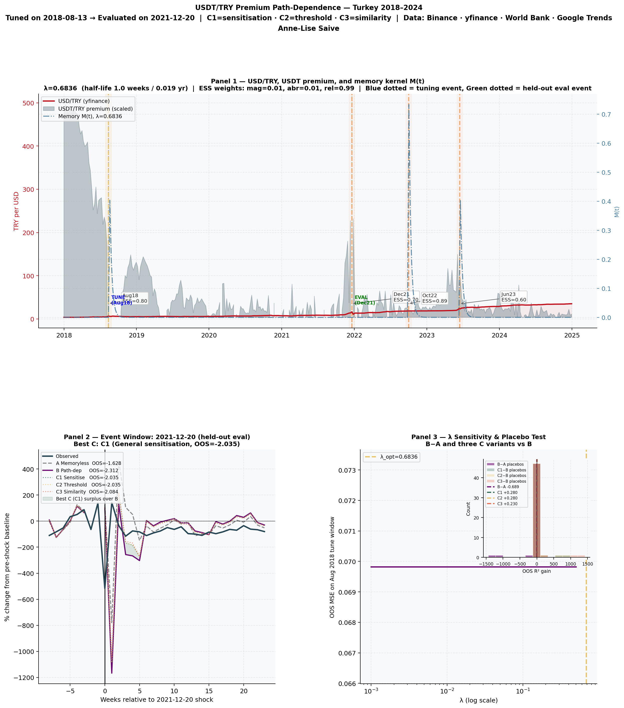

# USDT Demand Pressure in Turkey: A Path-Dependence Test

*Anne-Lise Saive (April 2026)*

## Overview

This is a self-initiated empirical project testing whether USDT demand pressure in Turkey responds to monetary shocks in a path-dependent way, where earlier high-salience shocks amplify the response to later ones.

The short answer is that, with public data, there is no robust evidence for this. The premium series appears to be dominated by short-horizon market dynamics rather than slower behavioral accumulation. A weaker signal shows up in first differences on one event window, but it does not hold as a general result. The null is the most reliable conclusion.



## Motivation

The hypothesis comes from computational models of salience-weighted memory. In these models, high-intensity past events reduce the threshold for reacting to related future cues. Formally, behavior depends not only on current input $x_t$, but on an accumulated memory term:

$$
\text{response}_t = f(x_t, M(t))
$$

where $M(t)$ summarizes prior exposure.

Transposed to this setting, a severe currency shock could leave a trace that makes later shocks trigger stronger demand for stablecoin protection, even if they are smaller.

Turkey provides a clean empirical setting, with three distinct and well-separated episodes:

- **August 2018**  tariff shock and rapid currency collapse
- **December 2021**  rate-cut driven crisis
- **June 2023**  post-election devaluation

These allow a simple tuning, evaluation, and robustness sequence without overlap.

## What is observed

The dependent variable is the USDT/TRY premium:

$$
p_t = \log\left(\frac{\text{USDT/TRY}_{\text{Binance}}}{\text{USD/TRY}_{\text{official}}}\right)
$$

This premium reflects how much local buyers are willing to pay above FX parity to access stablecoins quickly. It captures demand pressure and urgency. It is influenced by adoption, but also by liquidity conditions, arbitrage frictions, and constraints on capital movement. It should therefore be treated as a noisy proxy rather than a direct measure of user-level adoption.

## Data

All inputs are public and reproducible:

- Binance weekly USDT/TRY data
- FRED USD/TRY exchange rate
- World Bank CPI (used only for validation)
- Google Trends search interest in Turkey

Inflation is proxied using a rolling FX-based measure to match the weekly frequency of the data.

## Methodology

### Memory representation

Past shocks are summarized through a salience-weighted memory kernel:

$$
M(t) = \sum_{i} \text{ESS}_i \cdot e^{-\lambda(t - t_i)}
$$

Each event $i$ is assigned an Emotional Salience Score:

$$
\text{ESS}_i = w_{\text{mag}} \cdot \text{Magnitude}_i + w_{\text{abr}} \cdot \text{Abruptness}_i + w_{\text{rel}} \cdot \text{Relevance}_i
$$

The decay parameter $\lambda$ and weights $w$ are estimated on the August 2018 event and then held fixed.

### Model structure

Three nested models are compared.

**Model A  memoryless baseline**

$$
p_t = \alpha + \phi p_{t-1} + \beta X_t + \epsilon_t
$$

where $X_t$ includes FX shocks, volatility, inflation proxy, and search trends.

**Model B  path-dependence**

$$
p_t = \alpha + \phi p_{t-1} + \beta X_t + \gamma M(t) + \delta (X_t \cdot M(t)) + \epsilon_t
$$

This tests whether accumulated prior exposure modifies current responses.

**Model C  exploratory asymmetries**

Extensions of Model B introducing interactions such as:

$$
\text{Trends}_t \cdot M(t), \quad \text{Abruptness}_t \cdot M(t), \quad \text{Similarity}_t \cdot M(t)
$$

These test whether reactivation depends on attention, thresholds, or similarity to past events.

### Validation design

The design enforces strict separation:

- Parameters tuned on August 2018
- Evaluated out-of-sample on December 2021
- Tested again on June 2023 without refitting

Additional safeguards include event-centered windows, AR(1) structure to avoid leakage, a trend-null comparator, placebo tests on random dates, and bootstrap resampling.

## Results

### Levels: a clear null result

Out-of-sample performance in levels is strongly negative across all models in both evaluation windows. Model B does not outperform the baseline, and gains are indistinguishable from placebo variation.

This indicates that $R^2_{\text{OOS}} \ll 0$ for all specifications. The premium series is not predictable at this resolution using these inputs. This reflects the volatility and instability of the target, rather than a failure of a specific model.

### First differences: limited signal

Modeling changes in the premium $\Delta p_t = p_t - p_{t-1}$ produces a small positive out-of-sample $R^2$ in one robustness window. An interaction between search trends and accumulated exposure appears in that specification. However, it does not appear consistently across events, it is not present in the primary specification, and it does not survive as a general result. This is best interpreted as a tentative indication, not evidence.

### Memory timescale

The fitted decay parameter implies a very short effective memory. With $\lambda \approx 0.68$ on weekly data, the half-life is:

$$
t_{1/2} = \frac{\ln(2)}{\lambda} \approx 1 \text{ week}
$$

This is consistent with short-horizon market dynamics rather than slow behavioral accumulation. In practice, the memory kernel is capturing recent market conditions rather than long-lived exposure effects.

This sharpens the main conclusion. A behavioral path-dependence mechanism would predict longer persistence. What is observed instead is rapid decay, no out-of-sample gain over the memoryless baseline, and a placebo distribution indistinguishable from the real result. The fitted structure does not merely fail to support path-dependence — it actively contradicts the timescale that path-dependence would require.

## Interpretation

The absence of a robust signal does not imply that path-dependence does not exist. It indicates that it is not identifiable in this data.

The limitation is structural. The hypothesis concerns individual decision thresholds and behavioral adaptation over time. The observable variable is a market-level price proxy shaped by multiple layers of microstructure. Public data aggregates heterogeneous behavior into a single signal, which obscures the mechanism.

## What would test the hypothesis properly

A direct test would require wallet-level activity data, cohort segmentation, geographic resolution, and multiple countries and events. This would allow testing whether prior exposure changes adoption thresholds, timing, and persistence at the user level.

## Reproducing

```bash
git clone https://github.com/annelisesaive/usdt-demand-pressure-turkey
cd usdt-demand-pressure-turkey

python -m venv venv
source venv/bin/activate
pip install -r requirements.txt

python analysis.py
```

The script fetches all data sources automatically and produces the main figure in `figures/`.

## Files

- `analysis.py`  full pipeline from data ingestion to model evaluation
- `requirements.txt`  dependencies
- `figures/`  output plots

## Citation

Saive, A.-L. (2026). *USDT Demand Pressure in Turkey: A Path-Dependence Test.*
[github.com/annelisesaive/usdt-demand-pressure-turkey](https://github.com/annelisesaive/usdt-demand-pressure-turkey)
